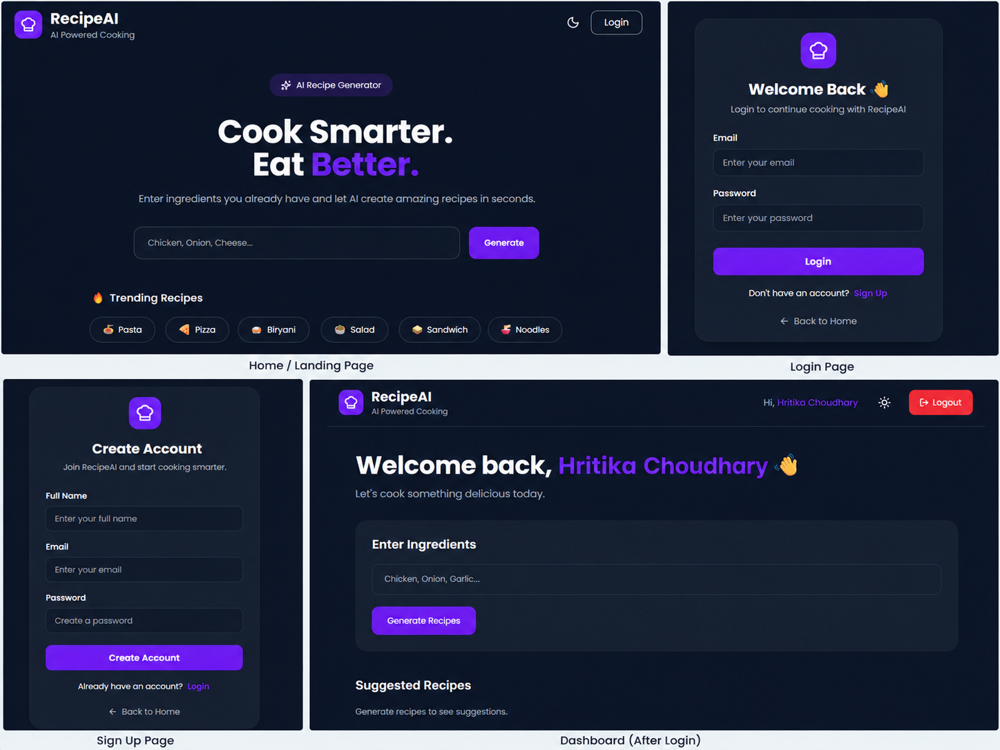

# 🍳 RecipeAI — AI-Powered Recipe Suggestion Bot

<div align="center">

**Turn the ingredients you already have into recipe ideas with Generative AI.**

[](https://www.python.org/)
[](https://react.dev/)
[](https://vite.dev/)
[](https://fastapi.tiangolo.com/)
[](https://www.sqlite.org/)
[](https://www.sqlalchemy.org/)
[](https://groq.com/)

</div>

---

## 📌 About the Project

**RecipeAI** is a full-stack AI-powered recipe suggestion application that helps users decide what to cook using ingredients they already have.

The user enters ingredients such as:

> `Chicken, Onion, Garlic`

RecipeAI sends the request to a **FastAPI backend**, which uses the **Groq API** and the `openai/gpt-oss-120b` model to generate **five recipe suggestions**.

After selecting a suggested recipe, the application asks the AI to generate a complete recipe with:

- Recipe name
- Cooking time
- Difficulty
- Ingredients
- Step-by-step cooking instructions
- Chef tip

The project also includes user registration, login, JWT-based authentication, password hashing, a SQLite database, and a React-based interface.

---

## 🎯 Project Objective

The main objective of RecipeAI is to demonstrate how **Generative AI can be integrated into a practical full-stack web application**.

It combines:

**React + Vite → FastAPI → Groq AI → SQLite**

to create a simple and useful AI cooking assistant.

---

## ✨ Features

### 🤖 AI Recipe Suggestions

- Enter ingredients available in your kitchen.
- Generate exactly **5 recipe suggestions**.
- Select any suggested recipe.
- Generate a complete recipe using AI.

### 🍽️ Complete Recipe Generation

Generated recipes contain:

- Recipe Name
- Cooking Time
- Difficulty
- Ingredients
- Cooking Steps
- Chef Tip

### 🔐 User Authentication

- User registration
- User login
- Password hashing using bcrypt
- JWT access-token authentication
- Protected dashboard

### 🎨 User Interface

- React-based frontend
- Responsive layout
- Light/Dark mode
- Interactive recipe suggestion buttons
- Loading state while generating recipes
- Toast notifications
- Recipe cards with structured content
- Food-themed background

---

## 🧩 Application Workflow

```text
                 ┌──────────────────────┐
                 │        User          │
                 └──────────┬───────────┘
                            │
                            ▼
                 ┌──────────────────────┐
                 │   React + Vite UI    │
                 │  Enter Ingredients   │
                 └──────────┬───────────┘
                            │
                         Axios
                            │
                            ▼
                 ┌──────────────────────┐
                 │    FastAPI Backend   │
                 └──────────┬───────────┘
                            │
                            ▼
                 ┌──────────────────────┐
                 │      Groq API        │
                 │ openai/gpt-oss-120b  │
                 └──────────┬───────────┘
                            │
                            ▼
                 ┌──────────────────────┐
                 │  5 Recipe Suggestions│
                 └──────────┬───────────┘
                            │
                    User selects recipe
                            │
                            ▼
                 ┌──────────────────────┐
                 │ Complete AI Recipe   │
                 │ + Chef Tip           │
                 └──────────────────────┘
```

---

## 🔄 How RecipeAI Works

### Step 1 — Enter Ingredients

The user enters ingredients they already have.

Example:

```text
Chicken, Onion, Garlic
```

### Step 2 — Generate Suggestions

The React frontend sends the ingredients to:

```text
POST /recipe/suggestions
```

The FastAPI backend sends a structured prompt to Groq AI.

The AI returns exactly five recipe names.

### Step 3 — Select a Recipe

The suggested recipes are displayed as interactive buttons.

### Step 4 — Generate the Full Recipe

When the user selects a recipe, the frontend sends the recipe name to:

```text
POST /recipe/generate
```

The AI then generates the complete recipe.

---

## 🔐 Authentication Flow

```text
User
 │
 ├── Sign Up
 │       │
 │       ▼
 │   Password hashed
 │       │
 │       ▼
 │   SQLite Database
 │
 └── Login
         │
         ▼
     Verify password
         │
         ▼
    JWT Access Token
         │
         ▼
   Protected Dashboard
```

---

## 🛠️ Tech Stack

### Frontend

- **React 19**
- **Vite 8**
- **Tailwind CSS 4**
- **Axios**
- **React Router**
- **Lucide React**
- **React Hot Toast**

### Backend

- **Python**
- **FastAPI**
- **SQLAlchemy**
- **SQLite**
- **Passlib / bcrypt**
- **python-jose**
- **python-dotenv**

### Generative AI

- **Groq API**
- **`openai/gpt-oss-120b`**

---

## 📂 Project Structure

```text
RecipeAI/
│
├── backend/
│   ├── ai_service.py
│   ├── auth.py
│   ├── database.py
│   ├── main.py
│   ├── models.py
│   ├── recipe.py
│   ├── schemas.py
│   ├── requirements.txt
│   └── .env
│
├── frontend/
│   ├── public/
│   │   ├── backgrounds/
│   │   │   └── background.png
│   │   ├── favicon.svg
│   │   └── icons.svg
│   │
│   ├── src/
│   │   ├── api/
│   │   │   └── api.js
│   │   ├── assets/
│   │   ├── components/
│   │   │   ├── IngredientInput.jsx
│   │   │   ├── Navbar.jsx
│   │   │   ├── ProtectedRoute.jsx
│   │   │   ├── RecipeCard.jsx
│   │   │   └── RecipeSuggestions.jsx
│   │   ├── pages/
│   │   │   ├── Dashboard.jsx
│   │   │   ├── Home.jsx
│   │   │   ├── Login.jsx
│   │   │   └── Signup.jsx
│   │   ├── App.jsx
│   │   ├── index.css
│   │   └── main.jsx
│   │
│   ├── package.json
│   └── vite.config.js
│
├── screenshots/
│   └── Screenshot.png
│
├── .gitignore
└── README.md
```

---

## 🌐 API Endpoints

| Method | Endpoint | Purpose |
|---|---|---|
| `GET` | `/` | API welcome message |
| `POST` | `/auth/signup` | Create a user account |
| `POST` | `/auth/login` | Authenticate a user |
| `POST` | `/recipe/suggestions` | Generate 5 recipe suggestions |
| `POST` | `/recipe/generate` | Generate a complete recipe |

---

## 🚀 Getting Started

### 1. Clone the Repository

```bash
git clone https://github.com/Hritika-07/RecipeAI.git
cd RecipeAI
```

### 2. Backend Setup

```bash
cd backend
python -m venv venv
```

#### Windows

```bash
venv\Scripts\activate
```

#### macOS / Linux

```bash
source venv/bin/activate
```

Install dependencies:

```bash
pip install -r requirements.txt
```

### 3. Configure Environment Variables

Create:

```text
backend/.env
```

Add:

```env
GROQ_API_KEY=your_groq_api_key
```

> Keep your API key private. Do not commit `.env` to GitHub.

### 4. Start the Backend

From the `backend` folder:

```bash
uvicorn main:app --reload
```

The API will run at:

```text
http://127.0.0.1:8000
```

### 5. Start the Frontend

Open a new terminal:

```bash
cd frontend
npm install
npm run dev
```

The frontend will normally be available at:

```text
http://localhost:5173
```

---

## 🖥️ Screenshot



---

## 🔒 Security Notes

- Passwords are hashed before being stored.
- Authentication uses JWT access tokens.
- The Groq API key is loaded from an environment variable.
- `.env` and local database files are excluded through `.gitignore`.
- Never publish API keys or other secrets in the repository.

---

## 📚 What This Project Demonstrates

This project demonstrates practical implementation of:

- Full-stack web development
- REST API development
- React frontend development
- FastAPI backend development
- Generative AI integration
- Prompt-based AI generation
- JWT authentication
- Password hashing
- SQLite database integration
- SQLAlchemy ORM
- Frontend-to-backend communication using Axios
- Responsive UI design

---

## 🔮 Future Enhancements

Possible future improvements include:

- ❤️ Favorite recipes
- 📜 Recipe history
- 🥗 Nutrition information
- 🎙️ Voice-based ingredient input
- 🌍 Multi-language recipe generation
- 📷 Ingredient recognition from images
- 🛒 Grocery-list generation
- 📄 Recipe export

---

## 👩‍💻 Developer

**Hritika Choudhary**

GitHub:  
https://github.com/Hritika-07

---

<div align="center">

### 🍳 RecipeAI

**Cook with what you have. Let AI suggest the rest.**

</div>
